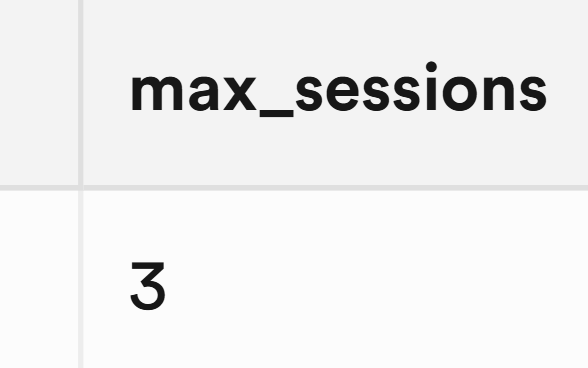

# SupaSession

> Advanced session management for Supabase

Limit and restrict user sessions in Supabase Auth, _without the Pro Plan_.

This is supposed to be an alternative to Supabase Pro's [single-session-per-user](https://supabase.com/docs/guides/auth/sessions#limiting-session-lifetime-and-number-of-allowed-sessions-per-user) feature, but more flexible and for the brokies.



## Prerequisites

- Supabase with Auth enabled

## Installation

Install via [database.dev](https://database.dev/Snehil_Shah/supasession):

```sql
SELECT dbdev.install('Snehil_Shah@supasession');
```

To learn how to install `dbdev` and published TLE extensions, read [here](https://supabase.github.io/dbdev/install-in-db-client/).

> [!WARNING]
> This extension is installed in the `supasession` schema and can potentially cause namespace collisions if you already had one before.

## Usage

```sql
CREATE EXTENSION "Snehil_Shah@supasession";
```

### Quick start

```sql
-- Enable session limits:
SELECT supasession.enable();

-- Set limits:
SELECT supasession.set_config(max_sessions := 3);
```

<!-- <docs> -->

### Types

#### supasession.enforcement_strategy

Represents the strategy for enforcing session limits.

- **dequeue** - Destroys the oldest session when the limit is reached.
- **reject** - Rejects any new sessions when the limit is reached.

### Tables

#### supasession.config

Extension configuration.

- **enabled** (`BOOLEAN`) - Whether session limiting is enabled. (Default: `FALSE`)
- **max_sessions** (`INTEGER`): Maximum number of active sessions allowed per user. (Default: `1`)
- **strategy** ([`supasession.enforcement_strategy`](#supasessionenforcement_strategy)): Enforcement strategy when the session limit is reached. (Default: `dequeue`)

### Functions

These functions provide a convenient layer on top of [`supasession.config`](#supasessionconfig) to manage extension configuration.
Alternatively, you can always directly query/update the [`supasession.config`](#supasessionconfig) table.

#### supasession.enable()

Enables session limits enforcement.

```sql
SELECT supasession.enable();
```

##### Returns:
  - `VOID`

#### supasession.disable()

Disables session limits enforcement.

```sql
SELECT supasession.disable();
```

##### Returns:
  - `VOID`

#### supasession.set_config([enabled BOOLEAN], [max_sessions INTEGER], [strategy supasession.enforcement_strategy])

Updates extension configuration.

```sql
SELECT supasession.set_config(max_sessions := 5);
SELECT supasession.set_config(enabled := FALSE, strategy := 'reject');
```

##### Parameters:
  - **enabled** (`BOOLEAN`, *optional*) - Whether session limiting is enabled
  - **max_sessions** (`INTEGER`, *optional*) - Maximum number of active sessions allowed per user
  - **strategy** ([`supasession.enforcement_strategy`](#supasessionenforcement_strategy), *optional*) - Enforcement strategy when the session limit is reached

##### Returns:
  - [`supasession.config`](#supasessionconfig) - Updated configuration

#### supasession.get_config()

Retrieves extension configuration.

```sql
SELECT supasession.get_config();
```

##### Returns:
  - [`supasession.config`](#supasessionconfig) - Current configuration

### Auth helpers

Helper functions to work with sessions within [RPCs](https://docs.postgrest.org/en/stable/references/api/functions.html).

#### supasession.sid()

Returns the session ID from the JWT of the current request. (Analogous to `auth.uid()`)

```sql
SELECT supasession.sid() AS session_id;
```

##### Returns:
  - `UUID|NULL` - The session ID (`auth.sessions.id`), or `NULL` if not available

<!-- /<docs> -->

## Caveats

Some things to be aware of:

- Just like Supabase's single-session-per-user, invalid users **won't be logged out immediately** when a new sign in occurs. A session stays active throughout the lifetime of the JWT access token and can only be invalidated once it expires. You can reduce the JWT expiry time to go against this, but Supabase doesn't recommend going below 5 minutes. To change the JWT expiration time, go to **Project Settings > JWT Keys** in your project dashboard, or set it under [`auth.jwt_expiry`](https://supabase.com/docs/guides/local-development/cli/config#auth.jwt_expiry) in `config.toml` for local instances.
- This extension can overestimate the number of valid sessions in certain cases where sessions are invalid due to Low AALs or timeouts. This is due to such configurations (mostly Pro features) being defined in the API layer which this extension doesn't have access to. Such sessions are still cleaned up by Supabase eventually, but during that window, blocking [enforcement strategies](#supasessionenforcement_strategy) like `reject` can cause your app to reject valid login requests.

  **TL;DR**: If you are using Pro Auth features like Time-boxes and inactivity timeouts, it's **recommended to use non-blocking enforcement strategies** like `dequeue`.
- As all strategies are enforced at the database level, you won't see the prettiest of error messages for blocking strategies like `reject`, requiring special error handling by the client.

***
